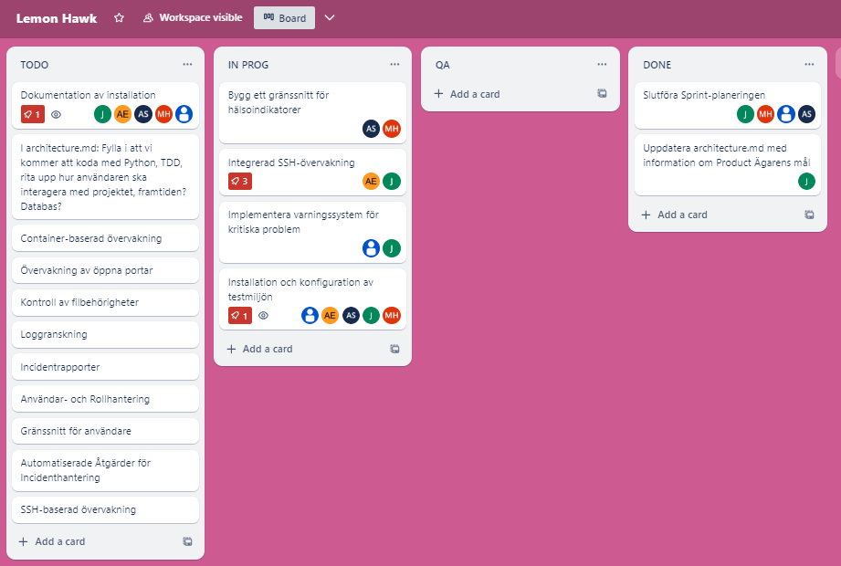

# Stand up 22 augusti
 **Vad har vi gjort sedan sist?**
Vi har gjort klar produktägarens backlog.
Sammanställt sprintplanneringen och lagt upp den på Trello så att vi vet vad som finns kvar på To-do list samt vad som är in progress.
Vi har tillsammans gått igenom pull request samt kommenterat dessa och mergat de.
Vi har skapat en flowchart för att få en bättre överblick på vad som skall göras samt hur processen ser ut. Architecture går ihop med flowchart där vi har skrivit ner vad som skall göras även vår målbild i ren text.

**Vad ska vi göra tills nästa gång?**
Påbörja konfigurationen av vår testmiljö.
Uppdatera dokumentationen
Väljer arbetsuppgifter från todo
Börja jobba med vald arbetsuppgift

**Hinder/Utmaningar?**

Knyta ihop planneringen på ett effektivt sätt.

