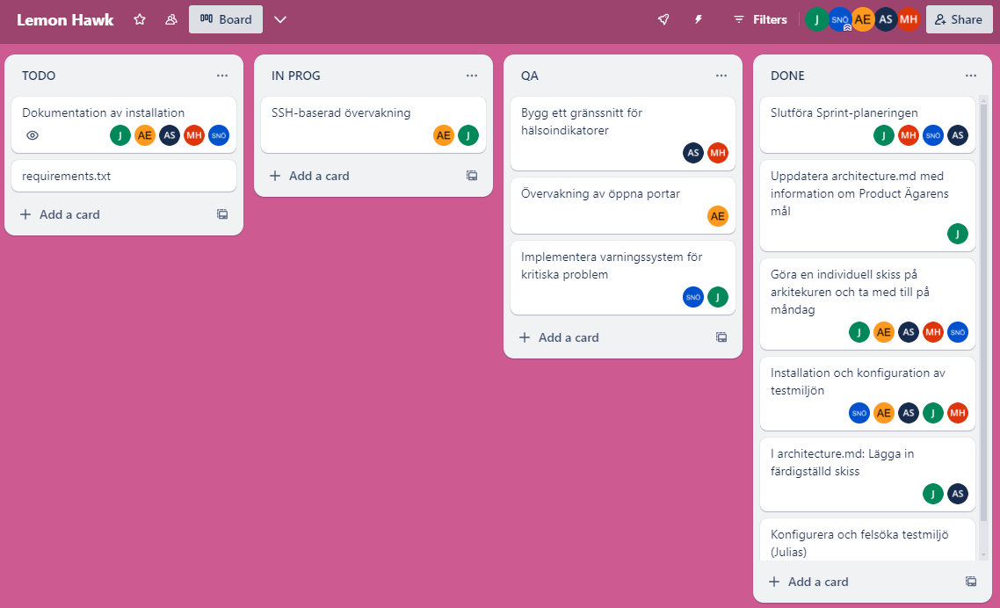

# Standup 27 augusti

#### Vad har vi gjort sedan sist?
* Utvecklat koden till övervakningsverktyget/gränssnittet och hittat lösningar i hur koden på 350 rader kan delas upp i flera olika skript men fortfarande ge samma resultat.
* Felsökt problem med testmiljöerna och de virtuella maskinerna (Linux)
* Skapat en tydligare arkitektur till architecture.md
* Varningssystem som notifierar administratör via e-mail.
* Loggningstrafik för trafiken genom de öppna portarna samt om portens belastning blir för stor eller om nätverkshastigheten är dålig skickas det till en separat fil

#### Vad ska vi göra tills nästa gång?
* Föra tydlig och strukutrerad dokumentation samt förbereda redovisningen
* QA: göra tester
* Testa övervakningsverktyget på Linux
* SSH-övervakning
* Dokumentation
* requirements.txt
* Skapa en .gitignore-fil

#### Hinder och utmaningar
* Få Linux-VM att fungera utan att krasha
* Hitta lösningar till GUI skipten vilket varit mycket tidskrävande

