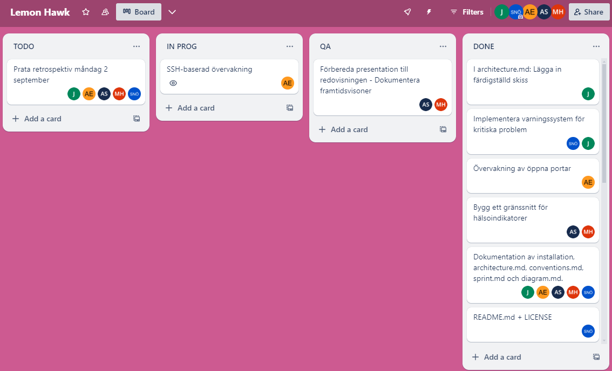
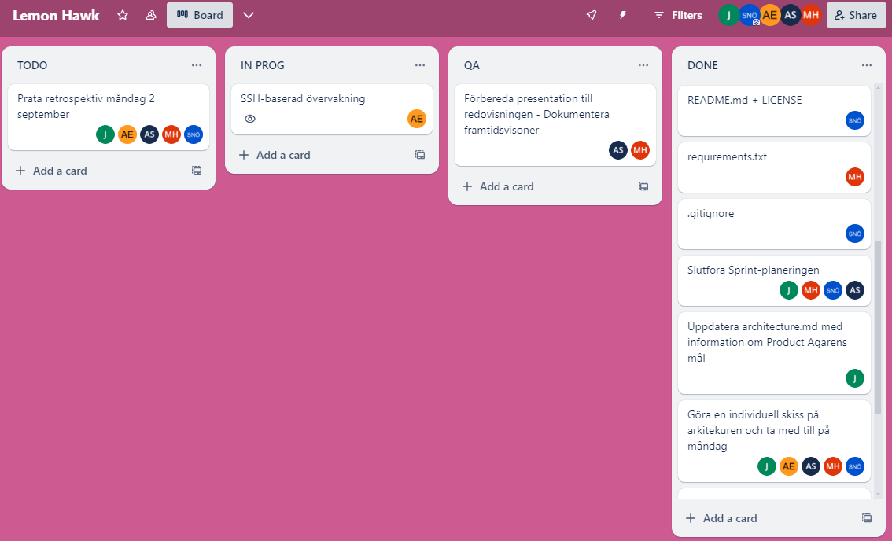
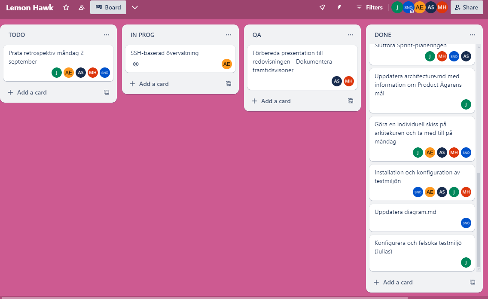

# Standup 29 augusti

#### Vad har vi gjort sedan sist?
* Föra tydlig och strukutrerad dokumentation samt förbereda redovisningen
* Testa övervakningsverktyget på Linux
* SSH-övervakning: Kommit fram till att vi flyttar detta moment tills nästa sprint.
* requirements.txt
* diagram.md
* Skapa en .gitignore-fil
* LICENSE
* Felsökning och QA av varningssystem
* Buggfix relaterat till argparse
* Uppdaterat architecture.md med information samt ny visuell bild
* Förbereda presentation och text inför redovisning
* README.md

#### Vad ska vi göra tills nästa gång?
* Sprint Retrospektiv
* Göra klart presentation/slides inför redovsning

#### Hinder och utmaningar
* GitHub: Köra korrekta kommandon i rätt sammanhang.

