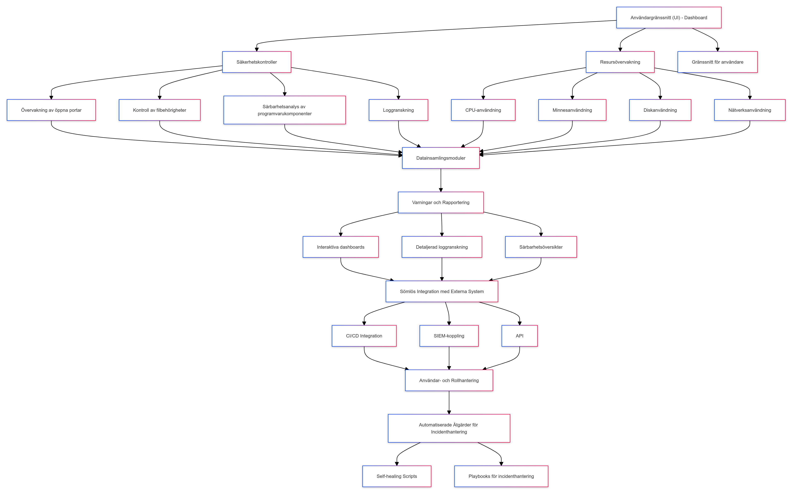

# Architecture

## Introduction

Our vision is to develop a user-friendly, specialized tool that prioritizes both security auditing and performance monitoring. This tool will be deployed in Windows and virtual Linux environments and will use a database for data storage.

The tool aims to assist the infrastructure team in maintaining performance and security by collecting and presenting critical data through a command-line interface. Key security vulnerabilities monitored include open ports, insecure permissions, high system load, and database performance. Critical issues are highlighted through visual representations such as graphs, tables, and lists.

## System Overview

### High-Level Description

The system is a specialized monitoring and auditing tool designed to enhance security and performance in Windows and Linux environments. It integrates with a database for storing log files, helping the infrastructure team proactively identify and address security vulnerabilities and performance issues. By collecting, storing, and presenting data in a user-friendly format, the system ensures both security and operational efficiency.

### Key Features

- **Security Auditing**: Monitors and identifies vulnerabilities such as open ports, insecure permissions, and high system loads.
- **Performance Monitoring**: Tracks performance metrics, focusing on database performance and system resource usage.
- **Data Collection and Storage**: Aggregates data from various sources and stores it in a central database for easy retrieval and historical analysis.
- **User Interface**: Offers both a command-line interface and a web-based interface for flexible data access and presentation.
- **Alerting and Reporting**: Generates alerts and presents them through graphs, tables, and lists for quick decision-making.

## Architecture Diagram

### Visual Representation

### Explanation of the Diagram Components and Data Flows

**Security Controls**
- **Open Port Monitoring**: Detects open ports that could pose security risks.
- **Control of Permissions**: Ensures proper permission settings to prevent unauthorized access.
- **Vulnerability Analysis**: Identifies vulnerabilities within software components.

These components work together to identify and mitigate potential security threats, with data being funneled into the Data Collection Modules.

**User Interface - Dashboard**
- **Resource Monitoring**: Reports on system resources such as CPU, memory, disk usage, and network activity.
- **User Interface for Users**: Provides graphical and command-line interfaces for user interaction.

The User Interface gathers data from the Resource Monitoring and Security Controls components and displays it to users. This data is sent to the Data Collection Modules for further processing.

**Data Collection Modules**
- **Central Data Aggregation Module**: Collects and organizes data from Security Controls and Resource Monitoring components, preparing it for reporting and action.

**Warnings and Reporting**
- **Interactive Dashboards**: Offers graphical data representations for user interaction.
- **Detailed Log Review**: Analyzes logs to identify issues or trends.
- **Security Overviews**: Summarizes the system’s security status and vulnerabilities.

This component generates reports and alerts based on the data processed by the Data Collection Modules, presenting them through the User Interface.

**Seamless Integration with External Systems**
- **CI/CD Integration**: Facilitates integration with Continuous Integration/Continuous Deployment pipelines.
- **SIEM Integration**: Links with Security Information and Event Management systems for enhanced monitoring.
- **API**: Provides access for external systems to interact with the tool.

**User and Role Management**
- **User Access Control**: Manages authentication and access rights.
- **Role-Based Access Management**: Defines and enforces user roles and permissions.

**Automated Actions for Incident Handling**
- **Self-Healing Scripts**: Automates responses to common incidents.
- **Playbooks for Incident Handling**: Provides procedures for handling specific incidents.

**Data Flow**

- **Input**: Data flows into the system through security controls and resource monitoring modules.
- **Processing**: Data is processed by the Data Collection Modules for analysis and reporting.
- **Output**: Processed data is used to generate alerts and reports and is integrated with external systems through APIs, CI/CD, and SIEM connections.
- **Action**: Automated actions are triggered based on predefined rules and scripts.

## Components

1. **Security Controls**
   - **Open Port Monitoring**: Scans for open ports that may pose security risks.
   - **Control of Permissions**: Ensures permissions are correctly set.
   - **Vulnerability Analysis**: Identifies vulnerabilities within software components.

2. **User Interface - Dashboard**
   - **Resource Monitoring**: Monitors system resources like CPU and memory.
   - **User Interface for Users**: Provides interaction interfaces for system monitoring and management.

3. **Data Collection Modules**
   - **Central Data Aggregation Module**: Gathers and organizes data from various sources.

4. **Warnings and Reporting**
   - **Interactive Dashboards**: Provides visual representations of data.
   - **Detailed Log Review**: Analyzes logs to detect issues or trends.
   - **Security Overviews**: Summarizes system security status and vulnerabilities.

5. **Seamless Integration with External Systems**
   - **CI/CD Integration**: Ensures compatibility with CI/CD pipelines.
   - **SIEM Integration**: Enhances security monitoring and response.
   - **API**: Allows for data access by external systems.

6. **User and Role Management**
   - **User Access Control**: Manages user authentication and access.
   - **Role-Based Access Management**: Defines and enforces user roles and permissions.

7. **Automated Actions for Incident Handling**
   - **Self-Healing Scripts**: Automates issue resolution.
   - **Playbooks for Incident Handling**: Provides predefined response procedures.

## Data Flow

**Data Sources**
- **Security Controls**: Collects data from network scans, permission checks, and software vulnerability assessments.
- **Resource Monitoring**: Gathers data on CPU, memory, disk usage, and network activity.
- **User Input**: Users can input data or commands through the CLI or GUI.

**Data Processing**
- **Collection**: Aggregates data in real-time from various sources.
- **Transformation**: Processes and structures data for analysis.
- **Analysis**: Detects key metrics and issues from the processed data.
- **Reporting**: Presents data through interactive dashboards, detailed logs, and security overviews.

**Data Storage**
- **Central Database**: Stores processed data and historical information.
- **Log Files**: Maintains logs for detailed audits and long-term monitoring.
- **Data Models**: Organizes data for efficient storage and retrieval.
- **Backup and Archiving**: Regular backups and archival of historical data.

## Technology Stack

**Languages and Frameworks**
- **Programming Languages**: Python
- **Frameworks and Libraries**:
  - **GUI**: Tkinter (for the graphical user interface)
  - **System Monitoring**: `psutil` (for resource monitoring)
  - **Networking**: `subprocess` (for executing system commands)
  - **Email Handling**: `smtplib`, `email.mime` (for notifications)
  - **Logging**: `logging` (for log management)

**Infrastructure**
- **Execution Environment**: Python environment on local or virtual machines.
- **System Monitoring**: Direct interaction with system resources and files.

**Third-Party Services**
- **Email Server**: SMTP server for email notifications.

**Detailed Components**
- **Command-Line Arguments**:
  - **System Health Thresholds**: Configurable thresholds for CPU, memory, disk, and network usage.
  - **Directories**: Directories for scanning insecure files.
  - **Email Configuration**: SMTP settings for email notifications.

**GUI Components**
- **Tkinter**: Provides a graphical interface for monitoring system health and SSH information.
- **Widgets**: Displays system metrics and logs.

**Monitoring and Logging**
- **Health Monitoring**: Uses `psutil` for system health monitoring.
- **SSH Information**: Retrieves open ports and file permissions.
- **Logging**: Manages logs for various events and warnings.

**Email Notifications**
- **Send Email**: Configured with SMTP for sending notifications based on specific conditions.

**File Operations**
- **Insecure File Checking**:
  - **Windows**: Uses `ctypes` for file permissions.
  - **Unix-like**: Checks for world-readable files using `os.stat`.

**Multithreading**
- **Background Tasks**: Runs health and SSH monitoring tasks in separate threads to avoid blocking the GUI.

**Usage Flow**
1. **Initialization**: Creates and displays the GUI using Tkinter.
2. **Monitoring**: Continuously monitors system health and SSH information.
3. **Logging and Notifications**: Logs warnings and sends emails based on conditions.
4. **File Security Check**: Scans directories for insecure files.

---
